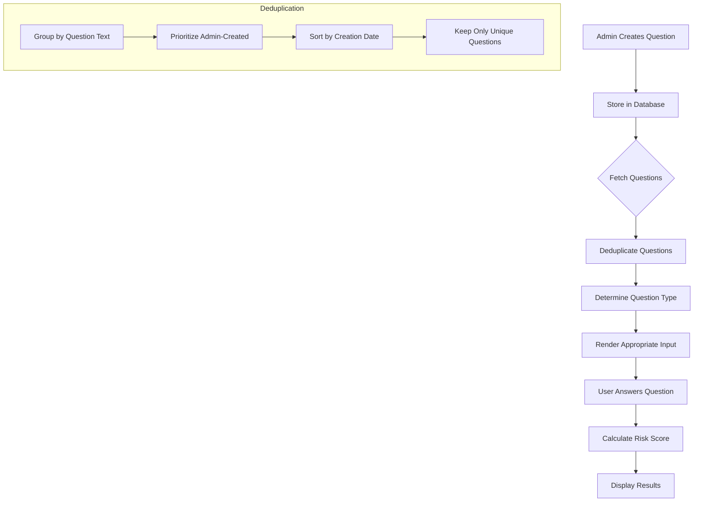
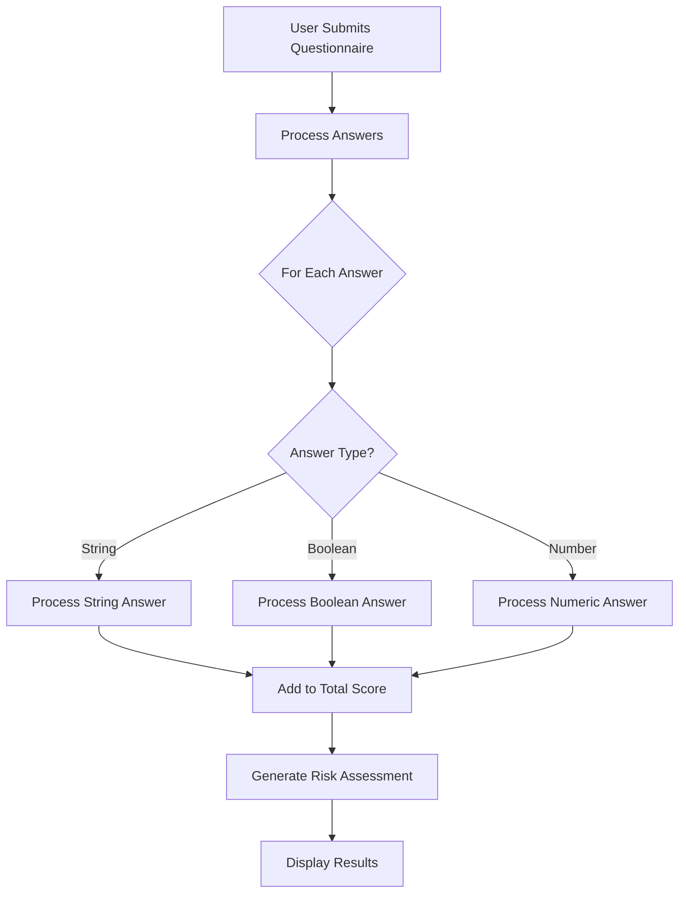

# DB-Driven Questionnaire Migration Plan

## Problem Analysis

Based on our investigation, there are several issues with the current questionnaire system:

1. **Duplicate Questions**: The same questions appear multiple times in the questionnaire
2. **Question Type Inconsistency**: Text input fields are sometimes showing up as dropdown menus
3. **Risk Score Calculation**: Scores are not being properly attributed to answers
4. **Admin-Created Questions**: Questions created in the admin panel aren't properly displayed in the patient questionnaire

## Root Cause Analysis

The root causes appear to be:

1. **No Deduplication Logic**: The system doesn't filter out duplicate questions when fetching from the database
2. **Incorrect Question Type Handling**: The code doesn't properly respect the question_type field from the database
3. **Hardcoded Question Logic**: The system has hardcoded questions that conflict with database-driven questions
4. **Missing Admin Question Priority**: There's no logic to prioritize admin-created questions over system-generated ones

## Solution Approach

Let's create a step-by-step plan to fix these issues:

### Step 1: Create a Restore Point

Before making any changes, we should create a proper restore point:

```sql
-- Create restore point tables
CREATE SCHEMA IF NOT EXISTS restore_points;
CREATE TABLE restore_points.questions_20240326 AS SELECT * FROM public.questions;
CREATE TABLE restore_points.question_options_20240326 AS SELECT * FROM public.question_options;
```

### Step 2: Implement Question Deduplication in QuestionnaireForm.tsx

```typescript
// Add deduplication logic to filter out duplicate questions
const uniqueQuestions = Object.values(
  questions.reduce((acc, q) => {
    const key = q.question.trim();
    
    // If we already have this question, only keep the newer one or admin-created one
    if (acc[key]) {
      // Prefer admin-created questions
      if (q.created_by && !acc[key].created_by) {
        acc[key] = q;
      } 
      // If both or neither are admin-created, prefer newer ones
      else if ((!q.created_by && !acc[key].created_by) || 
              (q.created_by && acc[key].created_by)) {
        const existingDate = new Date(acc[key].created_at || 0);
        const newDate = new Date(q.created_at || 0);
        if (newDate > existingDate) {
          acc[key] = q;
        }
      }
    } else {
      // First time seeing this question, add it
      acc[key] = q;
    }
    return acc;
  }, {})
);
```

### Step 3: Fix Question Type Handling

```typescript
// Ensure text fields are properly rendered as text inputs
if (question.id === "firstName" || question.id === "lastName" || 
    question.question_type === "text" || 
    question.question.includes("First Name") || 
    question.question.includes("Last Name")) {
  // Render as text input
  return (
    <Input
      type="text"
      value={String(answers[question.id] || "")}
      onChange={handleInputChange}
    />
  );
}
```

### Step 4: Improve Risk Score Calculation in PatientQuestionnaireService.ts

```typescript
// Handle different answer types for risk score calculation
if (typeof value === 'string') {
  if (value === "yes" || value === "true" || value === "1") {
    totalScore += riskScore;
    contributingFactors.push({
      question: questionDetails.question,
      answer: "Yes",
      score: riskScore
    });
  }
} else if (typeof value === 'boolean' && value === true) {
  totalScore += riskScore;
  contributingFactors.push({
    question: questionDetails.question,
    answer: "Yes",
    score: riskScore
  });
}
```

### Step 5: Add Database Indexes for Performance

```sql
-- Add indexes to improve question lookup performance
CREATE INDEX IF NOT EXISTS idx_questions_question ON public.questions(question);
CREATE INDEX IF NOT EXISTS idx_questions_created_by ON public.questions(created_by);
CREATE INDEX IF NOT EXISTS idx_questions_page_category ON public.questions(page_category);
```

## Implementation Plan

1. **Phase 1: Database Preparation**
   - Create restore point
   - Add necessary indexes
   - Clean up duplicate questions in the database

2. **Phase 2: Code Changes**
   - Update QuestionnaireForm.tsx with deduplication logic
   - Fix question type handling
   - Improve risk score calculation in PatientQuestionnaireService.ts

3. **Phase 3: Testing**
   - Test with admin-created questions
   - Verify no duplicates appear
   - Confirm text fields render correctly
   - Validate risk scores are calculated properly

4. **Phase 4: Deployment**
   - Deploy changes incrementally
   - Monitor for any issues
   - Have rollback plan ready

## Question Flow Diagram



## Risk Score Calculation Diagram



## Benefits of This Approach

1. **Eliminates Duplicates**: Users will only see one version of each question
2. **Prioritizes Admin Control**: Admin-created questions take precedence
3. **Respects Question Types**: Text fields will render correctly
4. **Accurate Risk Scores**: Scores will be properly calculated and attributed
5. **Improved Performance**: Database indexes will speed up question retrieval
6. **Safe Implementation**: Restore point allows for quick rollback if needed