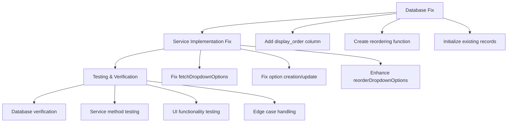

# Question Reordering Fix - Summary

## Overview

The question reordering functionality is not working properly due to inconsistencies between the database schema and the service implementation. This document summarizes the comprehensive solution to fix this issue without breaking any current functionality or introducing TypeScript errors.

## Key Issues Identified

1. **Database Schema Inconsistency**:
   - Uncertainty whether the `display_order` column exists in the `dropdown_options` table
   - The SQL script to add this column exists but may not have been executed

2. **Service Implementation Conflicts**:
   - Current `QuestionService.ts` attempts to use `display_order` field
   - `QuestionService.fixed.ts` explicitly removes this field from operations
   - Different ordering strategies used in different implementations

3. **Incomplete Reordering Implementation**:
   - The `reorderDropdownOptions` method may not be using the most efficient approach
   - A PostgreSQL function exists but may not be utilized properly

## Solution Documents

This fix is documented in three detailed guides:

1. [**QUESTION_REORDERING_FIX_PLAN.md**](./QUESTION_REORDERING_FIX_PLAN.md)
   - Comprehensive problem analysis
   - Detailed implementation plan
   - Code examples for each required change
   - Testing strategy overview

2. [**QUESTION_REORDERING_IMPLEMENTATION_STEPS.md**](./QUESTION_REORDERING_IMPLEMENTATION_STEPS.md)
   - Step-by-step implementation guide
   - Complete fix script code for automated implementation
   - Batch/shell scripts for running the fix
   - Integration considerations

3. [**QUESTION_REORDERING_TESTING_VERIFICATION.md**](./QUESTION_REORDERING_TESTING_VERIFICATION.md)
   - Comprehensive testing procedures
   - Database verification steps
   - TypeScript service testing examples
   - UI testing guidelines
   - Edge case handling verification

## Implementation Approach

The solution follows a three-step approach:

### 1. Database Schema Update

Ensure the `display_order` column exists and is properly configured:
- Add `display_order` column with default value if it doesn't exist
- Initialize existing records with sequential values
- Create an index for better query performance
- Add a PostgreSQL function for efficient reordering

### 2. Service Implementation Improvement

Modify `QuestionService.ts` to properly handle the `display_order` field:
- Update `fetchDropdownOptions` to order by `display_order`
- Ensure `createDropdownOption`, `updateDropdownOption`, and `saveDropdownOption` don't remove the `display_order` field
- Enhance `reorderDropdownOptions` with PostgreSQL function support and fallback mechanism

### 3. Verification and Testing

Thoroughly test the implementation:
- Verify database schema changes
- Test TypeScript service methods
- Check UI functionality
- Test edge cases
- Ensure no TypeScript errors are introduced

## Next Steps

1. **Review the detailed documents** to understand the full solution
2. **Execute the database update** using `add-display-order-to-dropdown-options.bat`
3. **Implement the service fix** by creating and running the fix script in `QUESTION_REORDERING_IMPLEMENTATION_STEPS.md`
4. **Verify the solution** using the testing procedures in `QUESTION_REORDERING_TESTING_VERIFICATION.md`

For implementation, switch to Code mode as suggested in the implementation steps document, since Architect mode is limited to creating and editing markdown files only.

## Conclusion

This comprehensive solution addresses all aspects of the question reordering functionality issue. By aligning the database schema with the service implementation and optimizing the reordering process, we'll ensure that the feature works correctly without breaking existing functionality or introducing TypeScript errors.